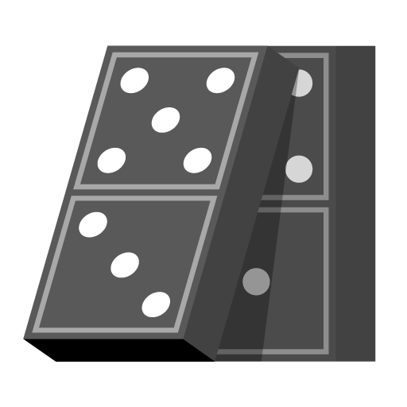

<!-- \mainpage -->
# uncertainties-cpp

C++ header library for first-order uncertainty propagation. More or less a port
of the python package [uncertainties](https://github.com/lebigot/uncertainties)
(but see also [gvar](https://github.com/gplepage/gvar),
[soerp](https://github.com/tisimst/soerp) and
[measurements.jl](https://github.com/JuliaPhysics/Measurements.jl)).

## Installation

It is a header library so there is no need to compile and install a binary.
Place the directory `uncertainties` in a place of your choice (possibly
alongside your code) and make sure to include the special header
`uncertainties/impl.hpp` in one (and only one) of your source files.

### Requirements

The C++ dialect is C++11. The header `ureals.hpp` (not to be confused with
`ureal.hpp`) requires [Eigen](http://eigen.tuxfamily.org).

## Usage

All the definitions are in the namespace `uncertainties`. The library is split
in various headers. The principal header is `ureal.hpp` which defines the class
template `UReal`, which is aliased to `udouble = UReal<double>` and
`ufloat = UReal<float>`.

Basic example:
~~~cpp
#include <iostream>
#include <uncertainties/ureal.hpp>
#include <uncertainties/io.hpp>
#include <uncertainties/impl.hpp>
namespace unc = uncertainties;
int main() {
    unc::udouble x(2, 1), y(2, 1);
    unc::udouble a = x - x;
    unc::udouble b = x - y;
    std::cout << a << ", " << b << "\n";
}
~~~

## Features

* Independent variables do not use the heap.

* Same class for independent and dependent variables.

* User-defined types supported.

Note: you cannot use `std::complex<udouble, udouble>` because it is not
supported by the standard library and you cannot use
`UReal<std::complex<double>>` because it does not keep track of the correlation
between the real and imaginary parts.

## Documentation

Use `doxygen` to generate the documentation in html format.

## Tests

Use `make` in the directory `test` to compile and run all the tests.

## License

This software is released under the GNU Lesser General Public license v3.0,
which means you can use it with differently licensed (eventually proprietary)
software provided that you release under the GPL/LGPL any modifications to this
library.
